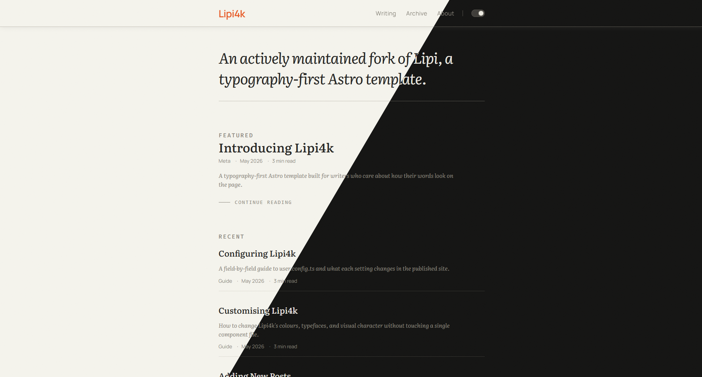

# Lipi4k

A maintained fork of [Lipi](https://github.com/thelocalhoststudio/lipi), a typography-first Astro template for long-form writing. Built for essays, travel notes, developer journals, and personal archives — publishing environments where the words come first.

**[Demo](https://vlavasa.github.io/lipi4k/)** · **[Source](https://github.com/vlavasa/lipi4k)** · **[Original Lipi project](https://github.com/thelocalhoststudio/lipi)** · **[Original Lipi demo](https://astro-lipi.pages.dev)**

> **Lipi** (लिपि) is the Sanskrit word for script, the written form of a language. **Lipi4k** is pronounced like “Lipi fork.”



---

## About this fork

Lipi4k was forked from [Lipi](https://github.com/thelocalhoststudio/lipi), created by [The Localhost Studio](https://github.com/thelocalhoststudio). It began as a place to prepare focused fixes for contribution back to the original project. As the original project appears to be no longer maintained, Lipi4k now continues its development independently and integrates those fixes into its own `main` branch.

Lipi4k retains the original project's design and purpose while providing ongoing maintenance, dependency updates, and fixes. The upstream repository remains an important reference and the starting point of this project.

---

## What Lipi4k is for

Lipi4k is a publishing template, not a general-purpose blog theme. It is designed for writers who publish chronologically and want their site to feel like a considered publication rather than a web application. It is not a good fit for sites that need sidebars, comment sections, newsletter embeds, or dashboards.

The visual design takes its cues from the [Kami](https://kami.tw93.fun) design language: warm parchment ground, a constrained reading measure (68 ch), generous line-height, and a single terracotta accent. The output is static HTML. The typography holds under Cmd+P.

---

## Features

- **Literata** body type, **Manrope** UI type, **Fira Code** for code, **Caveat** for annotations
- Light and dark themes via CSS custom properties, no JavaScript required for switching
- Warm neutral colour scale with a single brand accent — fully customisable in one file
- Paginated posts grouped by year
- Tag pages and tag-driven related posts
- Reading progress indicator via CSS scroll-driven animations
- Dynamic per-post OG images generated with Satori — no manual image creation
- Full-text search index via Pagefind — static, with no external API or tracking; exposing the search UI is still TODO
- RSS feed and sitemap included
- Shiki syntax highlighting with light/dark token mapping
- GitHub-Flavored Markdown and MDX support
- Paper texture and print-aware styles (Cmd+P layout preserved)
- Single configuration file: `configs/user.config.ts`
- Minimal client-side JavaScript

---

## Getting Started

### Use this template

```sh
npm create astro@latest -- --template vlavasa/lipi4k
```

### Clone manually

```sh
git clone https://github.com/vlavasa/lipi4k my-site
cd my-site
npm install
npm run dev
```

The dev server starts at `http://localhost:4321`.

### Deploy to GitHub Pages

The included GitHub Actions workflow deploys `main` to GitHub Pages. For this repository it sets `BASE_PATH=/lipi4k`, so the published site is available at `https://vlavasa.github.io/lipi4k/` while local development continues to use `/`.

In the repository settings, choose **GitHub Actions** as the Pages source. When reusing the template in another project repository, update `BASE_PATH` in `.github/workflows/deploy.yml` to match that repository name and set `url` in `configs/user.config.ts` to the corresponding GitHub Pages origin.

---

## Configuration

All site-level settings live in `configs/user.config.ts`. Open it, change the values, and the site reflects the changes.

```ts
// configs/user.config.ts
const userConfig: UserConfig = {
  title: "Your Publication",
  description: "What your site is about.",
  url: "https://yoursite.com",
  author: "Your Name",

  navigation: [
    { title: "Posts", url: "/posts" },
    { title: "Tags", url: "/tags" },
    { title: "About", url: "/about" },
  ],

  showThemeToggle: true,
  showReadingTime: true,
  heroVariant: "default",   // "default" | "studio"
};
```

The full configuration reference is available as a [rendered Configuring Lipi4k guide](https://vlavasa.github.io/lipi4k/posts/configuring-lipi4k/) and in its [Markdown source](./src/content/posts/configuring-lipi4k.md).

---

## Project Structure

```txt
lipi4k/
├── configs/
│   └── user.config.ts        # All site settings live here
├── public/
│   └── favicon.svg
├── src/
│   ├── content/
│   │   ├── posts/            # Markdown and MDX posts
│   │   └── pages/            # About, home intro, colophon, etc.
│   ├── styles/
│   │   ├── theme.css         # Colour tokens and font variables
│   │   ├── typography.css    # Prose styles
│   │   └── global.css        # Base reset and utilities
│   ├── components/
│   ├── layouts/
│   ├── pages/
│   └── utils/
├── astro.config.mjs
└── package.json
```

Posts go in `src/content/posts/`. Subdirectories are supported. Folders prefixed with `_` are stripped from the URL (useful for year-based organisation without year segments in slugs).

---

## Commands

| Command | Action |
| --- | --- |
| `npm install` | Install dependencies |
| `npm run dev` | Start dev server at `localhost:4321` |
| `npm run build` | Build to `./dist/`, generate Pagefind index |
| `npm run preview` | Preview the production build locally |

---

## Customising

### Colours

The colour system is a single warm neutral scale (`--base-50` through `--base-950`) plus one brand colour (`--brand`). Change both in `src/styles/theme.css`:

```css
:root {
  --base-50:  #F5F4ED;   /* ground */
  --base-950: #141413;   /* near-black */
  --brand:    #E85D2A;   /* accent */
}
```

To create a named colour scheme, add a `[data-theme="name"]` block and set the `data-theme` attribute on `<html>`.

### Typefaces

Fonts are configured in `astro.config.mjs` under the `fonts` array. Swap the `name` field to any typeface available on Fontsource.

---

## Content Schema

### Posts (`src/content/posts/`)

| Field | Type | Required | Notes |
| --- | --- | --- | --- |
| `title` | string | Yes | |
| `description` | string | Yes | Shown as deck on featured post and in feeds |
| `published` | date | Yes | `YYYY-MM-DD` |
| `updated` | date | No | Shows "Updated on" in post metadata |
| `category` | string | No | Defaults to `Travels` |
| `tags` | string[] | No | Drives related posts |
| `cover` | image / string | No | Overrides the auto-generated OG image |
| `draft` | boolean | No | Excluded from production builds |
| `lang` | string | No | Per-post language override |

### Pages (`src/content/pages/`)

| Field | Type | Required |
| --- | --- | --- |
| `title` | string | Yes |
| `description` | string | No |
| `updated` | date | Yes |
| `draft` | boolean | No |

---

## Credits

- Lipi4k is based on [Lipi](https://github.com/thelocalhoststudio/lipi), created by [The Localhost Studio](https://github.com/thelocalhoststudio)
- Typography inspired by the [Kami](https://kami.tw93.fun) design language
- Body typeface: [Literata](https://fonts.google.com/specimen/Literata) by TypeTogether
- UI typeface: [Manrope](https://fonts.google.com/specimen/Manrope) by Mikhail Sharanda
- Monospace: [Fira Code](https://github.com/tonsky/FiraCode) by Nikita Prokopov
- Annotation: [Caveat](https://fonts.google.com/specimen/Caveat) by Pablo Impallari
- Built with [Astro](https://astro.build), [Tailwind CSS v4](https://tailwindcss.com)
- Search powered by [Pagefind](https://pagefind.app)

---

## License

Lipi4k is distributed under the MIT License, the same license used by the [original Lipi project](https://github.com/thelocalhoststudio/lipi#license). The original project was made by [The Localhost Studio](https://github.com/thelocalhoststudio).
